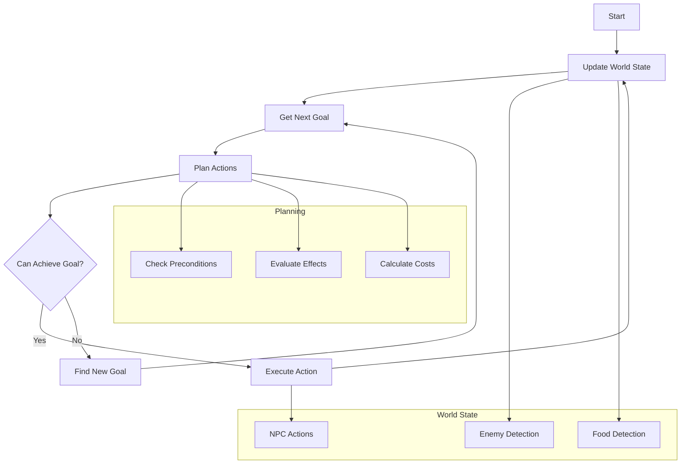

# GOAP for NPC AI

This project implements a Goal-Oriented Action Planning (GOAP) system for NPC AI in games. The system allows NPCs to plan and execute sequences of actions to achieve their goals based on the current world state.

## Overview

The system consists of several key components:

- **Action**: Represents a single action that an NPC can perform, with preconditions and effects
- **Planner**: Finds a sequence of actions to achieve a given goal
- **VisionSensor**: Simulates the NPC's perception of the environment
- **World State**: Tracks the current state of the game world

## Architecture

The system follows a typical GOAP architecture:

1. The NPC has a set of possible actions, each with:
   - Preconditions (what must be true to perform the action)
   - Effects (how the action changes the world state)
   - Expected effects (potential outcomes)
   - Cost (how "expensive" the action is)

2. The planner:
   - Takes a goal (desired world state)
   - Searches for a sequence of actions that can achieve the goal
   - Considers action costs to find efficient plans

3. The vision sensor:
   - Updates the world state based on what the NPC can perceive
   - Simulates detection of enemies and provisions

## Process Flow

## Usage

The system is designed to be integrated into a game engine. The main loop:
1. Updates the world state based on sensor input
2. Determines the next goal
3. Plans a sequence of actions to achieve the goal
4. Executes the planned actions

## Example Actions

The system includes several example actions:
- Basic movement (Idle, Walk, Run, Jump)
- Combat (Attack)
- Survival (Eat)
- Navigation (searching for enemies and provisions)

## Dependencies

- .NET Core
- No external dependencies required